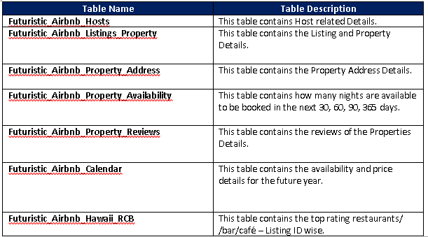
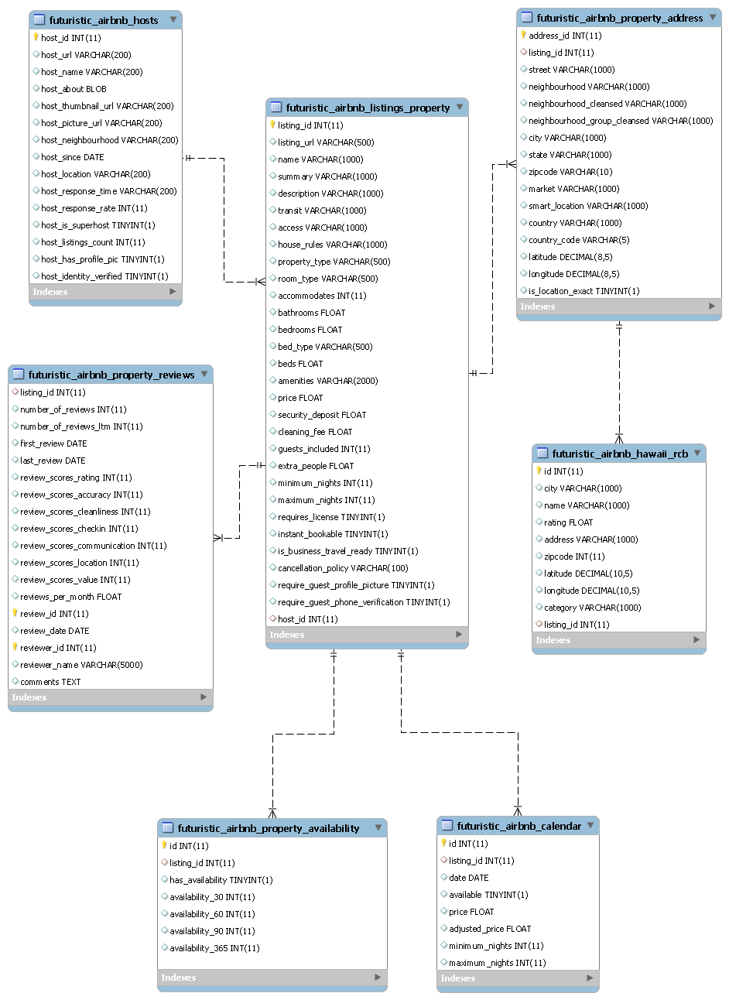

# <ins> Futuristic-Airbnb-ETL </ins>

## <ins> Source Data </ins>

The Data Set Used for the Project:
	Source Data
•	http://insideairbnb.com/about.html
•	https://www.kaggle.com/datasets

API Data 
	https://api.yelp.com/v3/businesses/search
	https://maps.googleapis.com/maps/api/geocode/json?

The Data Files used for this project are as below. 
•	<b>listings.csv </b> : This file contains data about the Airbnb Host, listing and Property Information. It also includes reviews scores & availability details of the property.  
•	<b> reviews.csv </b> : This file contains property review information.  
•	<b> calendar.csv </b> : This file contains data on Property availability and its price information for the future year.   
I used the <b> Yelp and Google api </b> to retrieve the top rated restaurants/café/bars for each listing.

## <ins> Target Data </ins>

## <ins> ERR Diagram </ins>

<b> The ETL Process FLow & Transformation Logic is present in the below Report :  
	<u>ETL Process Flow Report</u> : https://github.com/SaranyaPandiaraj/Futuristic-Airbnb-ETL/blob/master/Futuristic_Airbnb_ETL_Report.docx
	</b>
